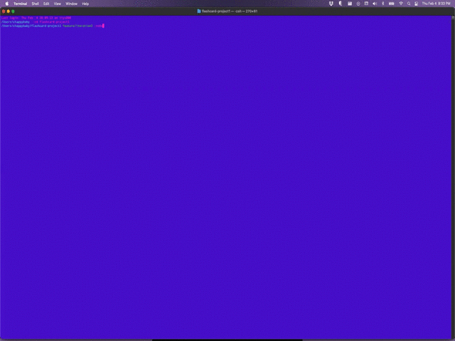

# FlashCards Starter Kit

## Contributors:

* [Joel Thomas](https://github.com/Shakikka)

## Technologies Used:

* JavaScript

## Abstract:

* This is a project of Classes and Test Driven Development. It is a text game
initiated in the terminal, that asks questions about programming vocabulary.

## Install/Setup Instructions:

* Clone down this repo from GitHub in your terminal by using `git clone https://github.com/Shakikka/flashcards-starter`

* cd into the flashcards-starter folder 

* Run `npm install`

## To Play:

* Run `node index.js`

* Enter the number that corresponds to the correct answer to the asked question and hit `Enter`

* Repeat until you finish
